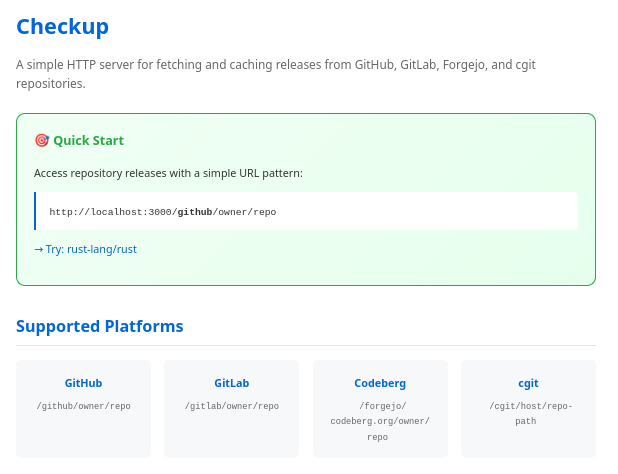
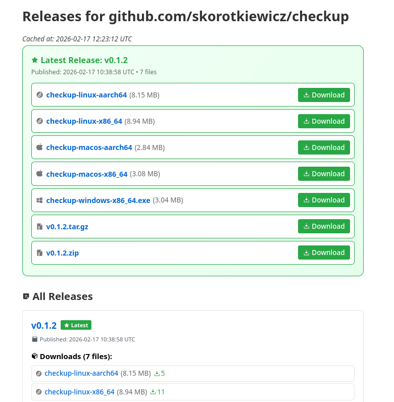

# Checkup - Repository Release Tracker

A simple HTTP server for fetching and caching releases from GitHub, GitLab, Forgejo, and cgit repositories.

<p align="center">
  
   
</p>

## Installation

### Arch Linux (AUR)

You can install `checkup` from the AUR using your favorite helper:

```bash
yay -S checkup
# or
paru -S checkup
```

### From Source

```bash
git clone https://github.com/skorotkiewicz/checkup
cd checkup
cargo build --release
```

## Usage

```bash
./target/release/checkup --cache data/ --port 3000
```

## Options

| Flag | Default | Description |
|------|---------|-------------|
| `-c, --cache` | `data/cache` | Cache directory |
| `-e, --cache-hours` | `24` | Cache expiration (hours) |
| `-p, --port` | `3000` | Server port |
| `--host` | `127.0.0.1` | Server host |

## Quick Examples

```bash
# GitHub
curl http://localhost:3000/github/rust-lang/rust

# GitLab
curl http://localhost:3000/gitlab/gitlab-org/gitlab

# Codeberg (Forgejo)
curl http://localhost:3000/forgejo/codeberg.org/forgejo/forgejo

# cgit (Linux kernel)
curl http://localhost:3000/cgit/git.kernel.org/pub/scm/linux/kernel/git/stable/linux.git

# Get latest asset
curl -L http://localhost:3000/github/owner/repo/latest.tar.gz

# Get cached JSON
curl http://localhost:3000/github/owner/repo/+json
```

## Features

- **Multi-platform**: GitHub, GitLab, Forgejo, Gitea, cgit
- **Smart caching**: Configurable expiration
- **Latest downloads**: Consistent URLs for latest releases
- **JSON API**: Programmatic access to cached data
- **Modular design**: Separate providers for each platform

## Project Structure

```
src/
├── main.rs           # Application entry point and routing
├── cache.rs          # Cache management
├── format_html.rs    # HTML formatting for releases
├── index.html        # Frontend page
└── provider/
    ├── mod.rs        # Provider module and shared types
    ├── github.rs     # GitHub provider
    ├── gitlab.rs     # GitLab provider
    ├── forgejo.rs    # Forgejo/Gitea provider
    └── cgit.rs       # cgit provider
```

## Documentation

- [API.md](API.md) - Full API documentation

## License

MIT
